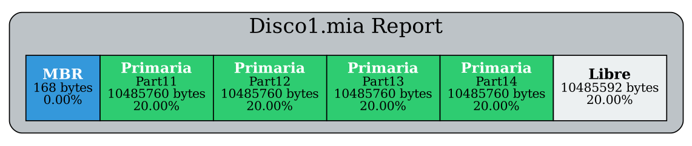
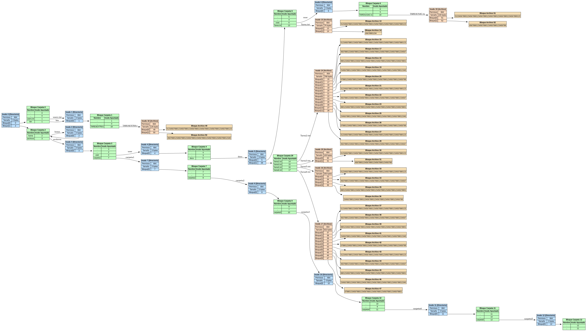

### **Proyecto MIA 2S2025**  
## 📘 Manual Técnico: GoDisk 

#### Universidad San Carlos de Guatemala
#### Facultad de Ingenieria
#### Manejo e Implementación de Archivos
#### Escuela de Ciencias y Sistemas

## Proyecto #1: GoDisk

#### Jairo Adelso Gomez Hernandez
#### 201902672
#### Guatemala 14 de Septiembre de 2025

## Simulador de Sistema de Archivos EXT2

---

## 📖 1. Introducción
Este documento detalla el diseño técnico y la implementación de **GoDisk**, una aplicación web creada para simular la gestión de un sistema de archivos **EXT2**.  
El objetivo principal es ofrecer una herramienta práctica y educativa que permita a los usuarios interactuar con las estructuras internas de un sistema de archivos, como el **MBR**, las particiones, los inodos y los bloques de datos, sin necesidad de hardware físico.

La aplicación consta de un **backend desarrollado en Go (Golang)**, que se encarga de toda la lógica de simulación, y una **interfaz de usuario web (frontend)** que facilita la interacción a través de una consola de comandos. El sistema está diseñado para ejecutarse localmente, utilizando archivos binarios con extensión `.mia` para simular los discos duros.

---

## 🖥️ 2. Arquitectura del Sistema
El sistema sigue una arquitectura **cliente-servidor desacoplada**, donde el frontend y el backend se comunican a través de una **API RESTful**.  
Toda la lógica de negocio reside en el backend, lo que garantiza una separación clara de responsabilidades y un mantenimiento más sencillo.

- **Frontend**: Aplicación web interactiva para enviar comandos manualmente o cargando scripts `.smia`.  
- **Backend (Go)**: Núcleo del sistema. Procesa los comandos y manipula los archivos `.mia`.  

📌 *Espacio para captura de pantalla de la arquitectura del proyecto (Figura 1 del PDF).*

### 2.1 Flujo de Ejecución
1. El usuario introduce un comando o carga un script `.smia`.  
2. El frontend envía los datos al backend mediante **HTTP POST** a `/execute`.  
3. El backend (`main.go`) recibe la solicitud y procesa línea por línea.  
4. El analizador (`Analizador/Analizador.go`) identifica comandos y parámetros.  
5. Cada función ejecuta la lógica de negocio (`mkdisk`, `fdisk`, `mkfile`).  
6. Los resultados (éxito, error o salida) se devuelven al frontend y se muestran.  

---

## 📂 3. Gestión de la Memoria y Persistencia
La simulación se basa en **archivos binarios** en lugar de estructuras en memoria. Cada operación actúa directamente sobre el disco `.mia`.  

📌 **Funciones clave (`Utils/Utils.go`):**
```go
// WriteFile escribe un objeto en un archivo binario en la posición especificada.
func WriteFile(file *os.File, data interface{}, position int64) error {
    if _, err := file.Seek(position, 0); err != nil {
        return fmt.Errorf("error al buscar la posición en el archivo: %v", err)
    }
    if err := binary.Write(file, binary.LittleEndian, data); err != nil {
        return fmt.Errorf("error al escribir el objeto en el archivo: %v", err)
    }
    return nil
}

// ReadFile lee un objeto de un archivo binario en la posición especificada.
func ReadFile(file *os.File, data interface{}, position int64) error {
    if _, err := file.Seek(position, 0); err != nil {
        return fmt.Errorf("error al buscar la posición en el archivo: %v", err)
    }
    if err := binary.Read(file, binary.LittleEndian, data); err != nil {
        return fmt.Errorf("error al leer el objeto del archivo: %v", err)
    }
    return nil
}
```

---

## 📑 4. Estructuras de Datos
Definidas en `Particiones/Partition.go`, representan directamente el contenido del disco binario.

### 4.1 Master Boot Record (MBR) y Particiones
```go
type MBR struct {
    MBR_Tamano    int32
    MBR_FechaCr   [19]byte
    MBR_DiskSig   int32
    MBR_DiskFit   [1]byte
    MBR_Partition [4]Partition
}

type Partition struct {
    Part_Status      [1]byte
    Part_Type        [1]byte // 'p' primaria, 'e' extendida
    Part_Fit         [1]byte
    Part_Start       int32
    Part_Size        int32
    Part_Name        [16]byte
    Part_Correlative int32
    Part_ID          [4]byte
}
```

### 4.2 Extended Boot Record (EBR)
```go
type EBR struct {
    Part_Mount byte
    Part_Fit   byte
    Part_Start int32
    Part_Size  int32
    Part_Next  int32 // Byte del siguiente EBR (-1 si es el último)
    Part_Name  [16]byte
}
```

### 4.3 Superbloque (SuperBlock)
```go
type SuperBlock struct {
    S_filesystem_type   int32
    S_inodes_count      int32
    S_blocks_count      int32
    S_free_blocks_count int32
    S_free_inodes_count int32
    S_mtime             [17]byte
    S_unmtime           [17]byte
    S_mnt_count         int32
    S_magic             int32 // 0xEF53
    S_inode_size        int32
    S_block_size        int32
    S_first_ino         int32
    S_first_blo         int32
    S_bm_inode_start    int32
    S_bm_block_start    int32
    S_inode_start       int32
    S_block_start       int32
}
```

### 4.4 Inodos y Bloques
```go
type Inode struct {
    I_uid   int32
    I_gid   int32
    I_size  int32
    I_atime [17]byte
    I_ctime [17]byte
    I_mtime [17]byte
    I_block [15]int32 // 12 directos, 1 indirecto simple, 1 doble, 1 triple
    I_type  [1]byte   // '0' carpeta, '1' archivo
    I_perm  [3]byte
}

type FolderBlock struct {
    B_content [4]Content
}

type FileBlock struct {
    B_content [64]byte
}
```

---

## ⚙️ 5. Implementación de Comandos Clave

### 5.1 Creación de Particiones (fdisk)
El comando `fdisk` gestiona las particiones dentro de un disco (`Entornos/fDisk.go`).  

**Algoritmos de ajuste (-fit):**
- **First Fit (FF):** Primer hueco disponible.  
- **Best Fit (BF):** Hueco más pequeño que cumpla.  
- **Worst Fit (WF):** Hueco más grande disponible.  

Proceso:
1. Leer MBR.  
2. Identificar huecos.  
3. Aplicar estrategia.  
4. Crear estructura `Partition`.  
5. Actualizar y reescribir MBR.  

---

### 5.2 Formateo del Sistema de Archivos (mkfs)
Implementado en `Estructuras/mkfs.go`, inicializa el sistema **EXT2** dentro de una partición.

- Cálculo dinámico de estructuras:  
  ```
  n = (TamañoPartición - sizeof(Superblock)) / (4 + sizeof(Inodo) + 3*sizeof(Bloque))
  ```
- Creación del **Superbloque**.  
- Inicialización de **bitmaps**.  
- Creación de la carpeta raíz `/` y archivo `users.txt`.  

📌 Ejemplo (`ext2.go`):
```go
func createRootAndUsersFile(sb Particiones.SuperBlock, date string, file *os.File) error {
    var inode0, inode1 Particiones.Inode
    // Inodo 0: Carpeta Raíz
    // Inodo 1: /users.txt
    // Bloques inicializados
}
```

---

## 📊 6. Sistema de Reportes
El comando `rep` usa **Graphviz** para generar reportes visuales o archivos `.txt`.

### 6.1 Reporte de Disco (disk)
- Vista de la distribución de particiones en el disco.  


### 6.2 Reporte de Árbol (tree)
- Recorrido recursivo del sistema desde el inodo raíz.  
- Construcción del grafo en formato DOT.  

Ejemplo (`Reporte_TREE.go`):
```go
func processInodeForTree(inodeIndex int32, file *os.File, sb Particiones.SuperBlock, dot *strings.Builder, processedInodes map[int32]bool) error {
    renderInodeAsTable(inodeIndex, inode, dot)
    // Procesar hijos si es directorio
}
```



---

## 📖 7. Conclusión
**GoDisk** es una simulación completa y robusta de **EXT2**, implementada en Go.  
- Arquitectura modular.  
- Persistencia directa en disco.  
- Sistema de reportes gráfico.  

Sirve tanto como herramienta **funcional** como **educativa** para comprender los sistemas de archivos.  

---