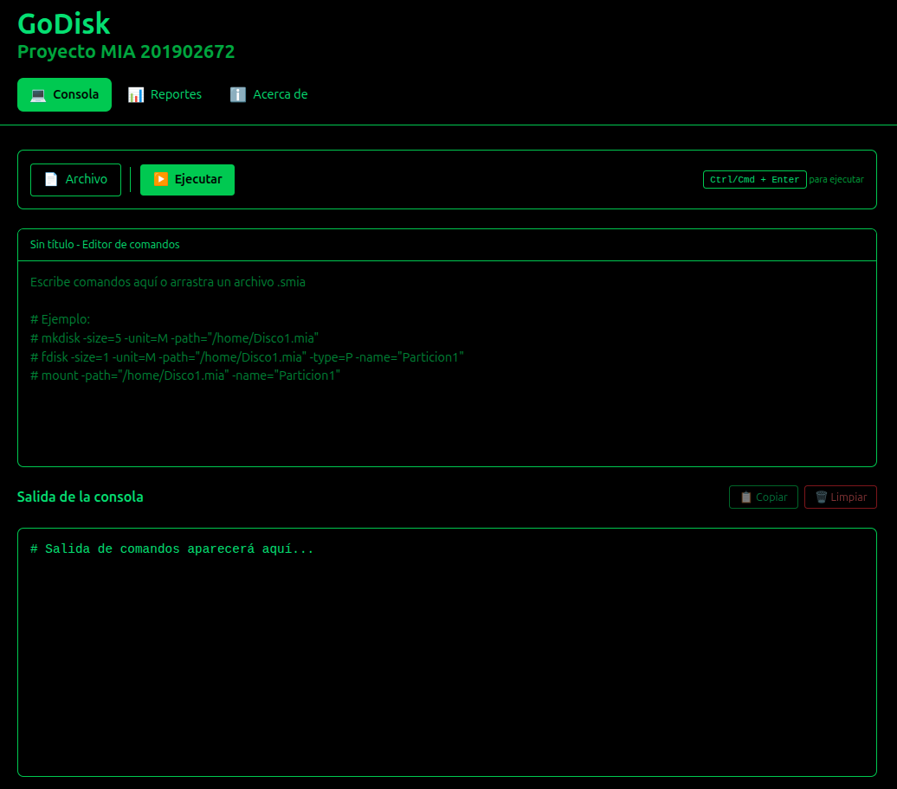
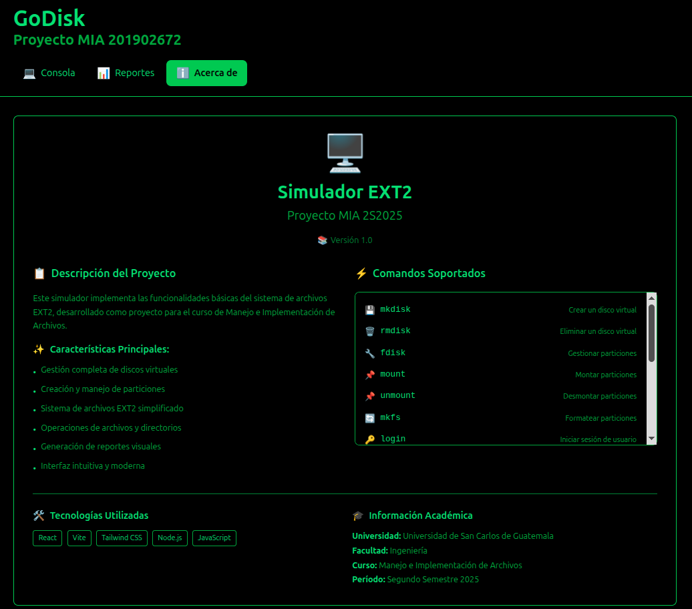
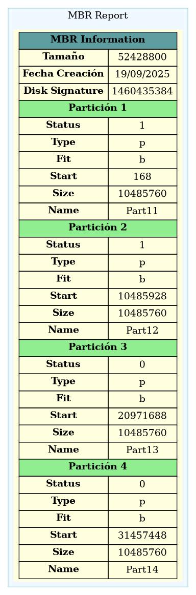
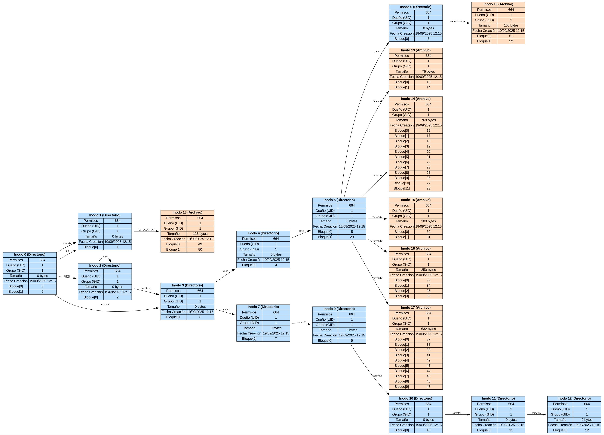
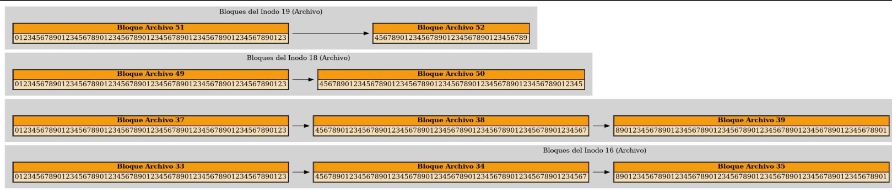
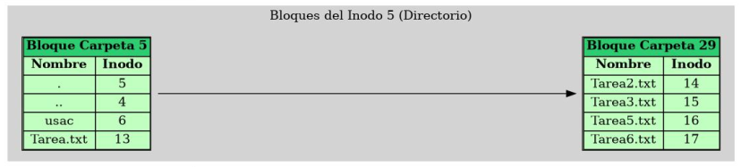

### **Proyecto MIA 2S2025** 
# 📘 Manual de Usuario

#### Universidad San Carlos de Guatemala
#### Facultad de Ingenieria
#### Manejo e Implementación de Archivos
#### Escuela de Ciencias y Sistemas

## Proyecto #1: GoDisk

#### Jairo Adelso Gomez Hernandez
#### 201902672
#### Guatemala 14 de Septiembre de 2025

## Simulador de Sistema de Archivos EXT2  
 
---

## 📑 Índice
1. [Introducción](#introducción)  
2. [Requisitos](#requisitos)  
3. [Interfaz de Usuario](#interfaz-de-usuario)  
4. [Comandos Disponibles](#comandos-disponibles)  
   - [Gestión de Discos](#gestión-de-discos)  
   - [Gestión de Particiones](#gestión-de-particiones)  
   - [Montaje y Formateo](#montaje-y-formateo)  
   - [Gestión de Usuarios y Grupos](#gestión-de-usuarios-y-grupos)  
   - [Gestión de Archivos y Directorios](#gestión-de-archivos-y-directorios)  
   - [Reportes](#reportes)  
5. [Ejemplos de Uso](#ejemplos-de-uso)  
6. [Capturas de Interfaz](#capturas-de-interfaz)  
7. [Autores](#autores)  

---

## 📖 Introducción
Este sistema permite **simular y administrar un sistema de archivos EXT2**.  
Está desarrollado en **Go** para el backend y cuenta con una interfaz que muestra la ejecución de comandos y los reportes generados.  

El objetivo es **comprender la lógica interna de los sistemas de archivos**: discos, particiones, montaje, inodos, permisos, usuarios, etc., sin necesidad de hardware físico.  

---

## ⚙️ Requisitos
- Go 1.20+  
- Graphviz (para reportes)  
- Sistema operativo Linux/Windows  

---

## 🖥️ Interfaz de Usuario
La aplicación cuenta con una consola interactiva donde se pueden ingresar comandos.  
Ejemplo de pantalla:  

  

Cada comando se procesa y devuelve mensajes detallados de éxito o error.  

---

## 🛠️ Comandos Disponibles

### 📂 Gestión de Discos
- **`mkdisk`** → Crea un nuevo disco.
   - `mkdisk -size=50 -unit=M -fit=ff -path=/home/user/Disco1.mia `
 
 - **`rmdisk`** → Elimina un disco existente.  
   - `rmdisk -path=/home/user/Disco1.dsk`

### 🧩 Gestión de Particiones
- **`fdisk`** → Crea o elimina particiones en un disco.  
  - `fdisk -size=20 -unit=M -type=p -fit=wf -path=/home/user/Disco1.dsk -name=Part1`

### 🔗 Montaje y Formateo
- **`mount`** → Monta una partición y le asigna un ID.  
  - `mount -path=/home/user/Disco1.dsk -name=Part1`

- **`mounted`** → Lista las particiones montadas.  
  - `mounted`

- **`mkfs`** → Formatea una partición en EXT2. 
  - `mkfs -id=6721a -type=full -fs=2fs`

### 👥 Gestión de Usuarios y Grupos
- **`login`** → Inicia sesión en una partición.
  - `login -user=root -pass=123 -id=6721a`

- **`logout`** → Cierra sesión.
  - `logout`

- **`mkgrp`** → Crear grupos.
   - `mkgrp -name=usuarios`

- **`rmgrp`** → Eliminar grupos.  
  - `rmgrp -name=usuarios​`

- **`mkusr`** → Crear Usuarios.
    - `mkusr -user=user1 -pass=abc -grp=usuarios`

- **`rmusr`** → Eliminar usuarios
    - `rmusr -user=user2`

- **`chgrp`** → Cambiar grupo de un usuario.  
    - `chgrp -user=user1 -grp=grupo2`

### 📁 Gestión de Archivos y Directorios
- **`mkdir`** → Crear directorios.  
    - `mkdir -path=/home/docs/user -p`

- **`mkfile`** → Crear archivos. 
    - `mkfile -path=/home/docs/archivo.txt -size=100`

- **`cat`** → Mostrar el contenido de un archivo.
    - `cat -file=/home/docs/archivo.txt`

### 📊 Reportes
- **`rep`** → Genera reportes de estructuras internas.  
- `mbr` → Reporte del MBR  
- `disk` → Reporte del estado del disco  
- `inode` → Reporte de inodos  
- `block` → Reporte de bloques  
- `sb` → Reporte del Superbloque  
- `file` → Reporte de un archivo específico  
- `ls` → Reporte de un directorio
- `tree` → Reporte de Arbol  

---

## 🖼️ Capturas de Interfaz
### Consola de Comandos  
  

### Reporte MBR  
  

### Reporte Disco  
  

### Reporte Inode

### Reporte Block

### Reporte Tree

---

## ✒️ Autores
- **Jairo Adelso Gómez Hernández** 
- **201902672** 
- **Universidad de San Carlos de Guatemala**
- **Facultad de Ingeniería**  
- **Curso: Manejo e Implementación de Archivos (MIA) – 2S 2025**