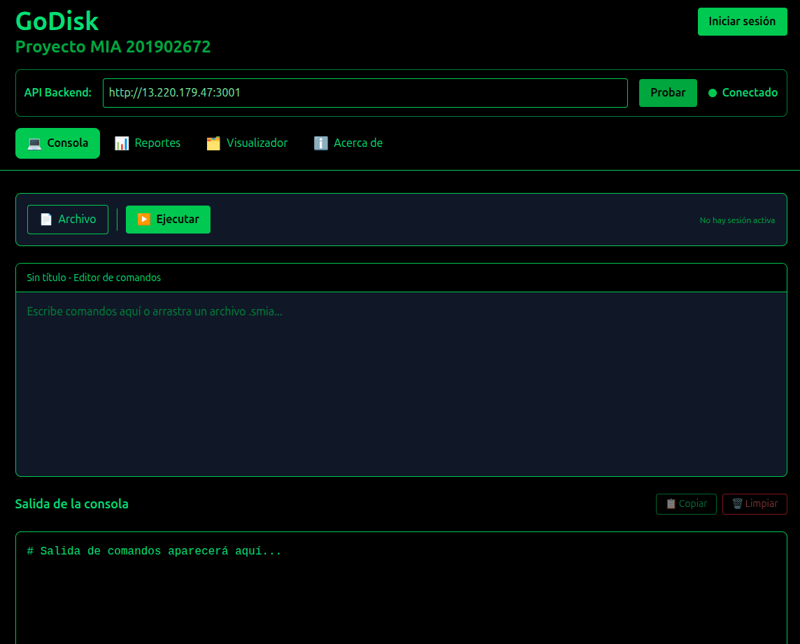
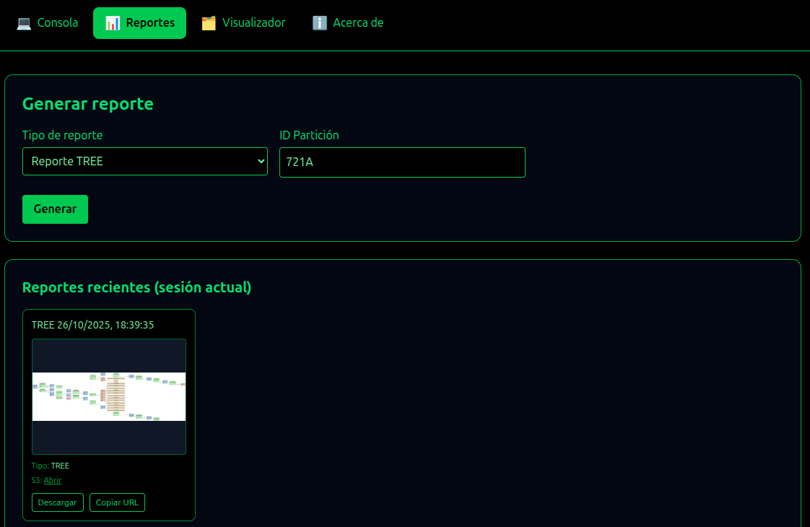
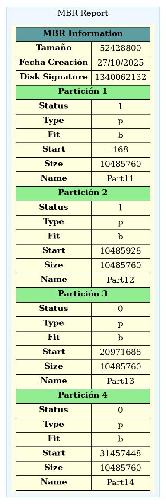
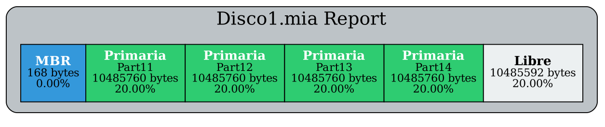
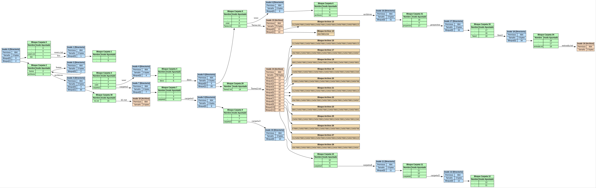
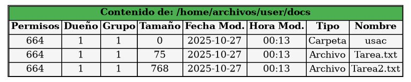
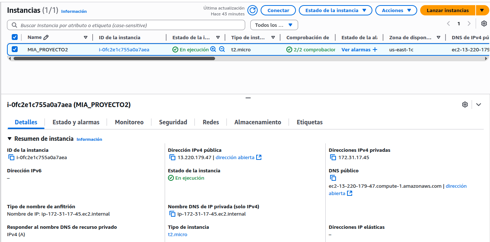
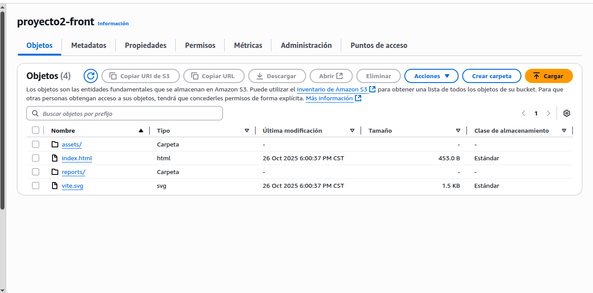
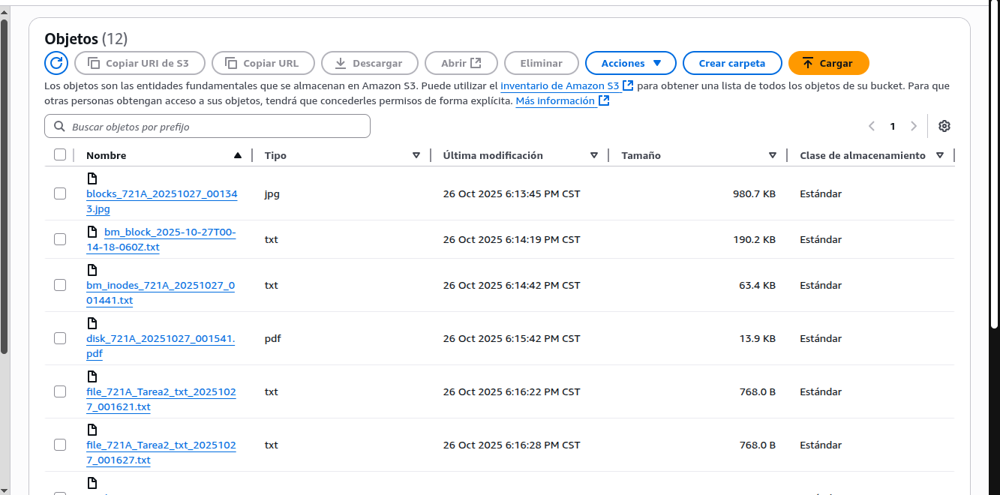

# 📘 Manual de Usuario – GoDisk 2.0  
### **Proyecto MIA 2S2025**

#### Universidad San Carlos de Guatemala  
#### Facultad de Ingeniería  
#### Escuela de Ciencias y Sistemas  
#### Curso: Manejo e Implementación de Archivos  

---

## 📄 Datos del Proyecto
**Proyecto:** GoDisk – Simulador de Sistema de Archivos EXT2/EXT3  
**Estudiante:** Jairo Adelso Gómez Hernández  
**Carnet:** 201902672  
**Fecha:** Guatemala, Octubre 2025  

---

## 📑 Índice

1. [Introducción](#introducción)  
2. [Requisitos](#requisitos)  
3. [Arquitectura General](#arquitectura-general)  
4. [Despliegue en la Nube (Fase 2)](#fase-2-despliegue-en-la-nube)  
5. [Interfaz de Usuario](#interfaz-de-usuario)  
6. [Comandos Disponibles](#comandos-disponibles)  
   - [Gestión de Discos](#gestión-de-discos)  
   - [Gestión de Particiones](#gestión-de-particiones)  
   - [Montaje y Formateo](#montaje-y-formateo)  
   - [Gestión de Usuarios y Grupos](#gestión-de-usuarios-y-grupos)  
   - [Gestión de Archivos y Directorios](#gestión-de-archivos-y-directorios)  
   - [Reportes](#reportes)  
7. [Ejemplos de Uso](#ejemplos-de-uso)  
8. [Capturas de Interfaz y Reportes](#capturas-de-interfaz-y-reportes)  
9. [Autores](#autores)  

---

## 📖 Introducción

**GoDisk** es una aplicación web multiplataforma desarrollada en **Go (Golang)** que simula un sistema de archivos **EXT2 y EXT3**.  
Su propósito es **comprender la estructura interna** de un sistema de archivos real —inodos, bloques, superbloques, bitmaps, permisos, usuarios y grupos— desde una perspectiva práctica e interactiva.  

La aplicación permite **ejecutar comandos en una terminal web**, **gestionar usuarios**, **crear discos y particiones**, **visualizar estructuras** mediante reportes gráficos y, en su segunda fase, **desplegar el sistema completo en la nube con AWS**.

---

## ⚙️ Requisitos

### Requisitos Locales
- **Go 1.20+**
- **Graphviz** (para reportes .dot → .jpg)
- **Sistema operativo:** Linux o Windows

### Requisitos Nube (AWS)
- Cuenta activa en **Amazon Web Services (AWS)**
- **Instancia EC2** con Ubuntu Server 22.04+
- **Bucket S3** configurado como **sitio web estático**
- **Región recomendada:** `us-east-1`
- Permisos en **IAM** para S3, EC2 y CloudFront (si se usa CDN)

---

## 🏗️ Arquitectura General

La aplicación sigue una **arquitectura cliente-servidor**:

```
┌────────────────────┐          ┌────────────────────────────┐
│     Frontend       │   HTTP   │          Backend            │
│ (React / Web App)  │────────▶│ (Go Fiber API - EXT2/3 FS) │
│  + Terminal Web     │         │ Ejecuta comandos y genera  │
│  + Reportes visuales│         │ reportes con Graphviz       │
└────────────────────┘          └────────────────────────────┘
           │                              │
           ▼                              ▼
     AWS S3 (HTML/CSS/JS)          AWS EC2 (Linux - Go)
```

El **frontend** envía los comandos al backend mediante peticiones REST.  
El **backend en Go** interpreta y ejecuta los comandos en archivos binarios `.mia`, simulando operaciones reales sobre discos, particiones y usuarios.

---

## ☁️ Fase 2: Despliegue en la Nube

En esta segunda fase, **GoDisk** fue desplegado completamente en la infraestructura de **Amazon Web Services (AWS)**, logrando una versión **accesible desde cualquier navegador**.

### 🔹 Backend en EC2

- **Tecnología:** Go (Fiber Framework)
- **Instancia:** Amazon EC2 – Ubuntu Server 22.04
- **Puerto de ejecución:** `:3001`
- **Servicio desplegado:** API REST GoDisk
- **URL de acceso:** `http://<tu-ip-ec2>:3001/execute`
- **Archivo principal:** `main.go`

**Configuración básica:**
```bash
# Instalar dependencias
sudo apt update
sudo apt install golang -y

# Clonar repositorio
git clone https://github.com/usuario/MIA_2S2025_P2_201902672.git
cd backend

# Ejecutar backend
go run main.go
```

---

### 🔹 Frontend en AWS S3

- **Tecnología:** React + Vite / HTML + JS
- **Servicio:** Amazon S3 configurado como “Sitio Web Estático”
- **Función:** Cargar interfaz web que se comunica con la API del backend
- **URL de acceso:** `http://<bucket-name>.s3-website-us-east-1.amazonaws.com`

**Pasos básicos:**
1. Crear bucket S3 con nombre único.  
2. Habilitar **Static Website Hosting**.  
3. Subir los archivos del frontend (`index.html`, `/assets`, `/js`, etc.).  
4. Configurar política pública:
```json
{
  "Version": "2012-10-17",
  "Statement": [{
    "Sid": "PublicReadGetObject",
    "Effect": "Allow",
    "Principal": "*",
    "Action": "s3:GetObject",
    "Resource": "arn:aws:s3:::nombre-bucket/*"
  }]
}
```


---

## 🌐 ¿Qué es la Nube y por qué AWS?

La **nube** es una infraestructura virtual que permite almacenar, ejecutar y escalar aplicaciones sin depender de hardware físico local.

### Beneficios principales:
- 🌎 **Acceso global:** Puedes usar tu simulador desde cualquier lugar.
- ⚡ **Desempeño y escalabilidad:** AWS EC2 permite manejar múltiples usuarios y peticiones.
- 🔐 **Seguridad:** Control de acceso y monitoreo continuo.
- 💾 **Disponibilidad permanente:** El sistema sigue operativo aunque el equipo local esté apagado.

📸 *[Espacio para diagrama de arquitectura en AWS]*

---

## 🖥️ Interfaz de Usuario

La interfaz cuenta con:

- Terminal interactiva para ingresar comandos.  
- Área de salida de resultados.  
- Sección de reportes generados (MBR, árbol, bloques, etc.).  
- Botón de **Inicio de Sesión / Cierre de Sesión**.

📸 *[Captura de la interfaz principal]*

Ejemplo:

```bash
> mkdisk -size=50 -unit=M -fit=FF -path=/home/user/Disco1.mia
✅ Disco creado correctamente.
```

---

## 🛠️ Comandos Disponibles

### 📂 Gestión de Discos
```bash
mkdisk -size=50 -unit=M -fit=ff -path=/home/user/Disco1.mia
rmdisk -path=/home/user/Disco1.mia
```

### 🧩 Gestión de Particiones
```bash
fdisk -size=20 -unit=M -type=p -fit=wf -path=/home/user/Disco1.mia -name=Part1
```

### 🔗 Montaje y Formateo
```bash
mount -path=/home/user/Disco1.mia -name=Part1
mkfs -id=6721a -type=full -fs=2fs
```

### 👥 Usuarios y Grupos
```bash
login -user=root -pass=123 -id=6721a
mkgrp -name=usuarios
mkusr -user=jairo -pass=123 -grp=usuarios
logout
```

### 📁 Archivos y Directorios
```bash
mkdir -path=/home/docs -p
mkfile -path=/home/docs/archivo.txt -size=128
cat -file=/home/docs/archivo.txt
```

### 📊 Reportes
```bash
rep -id=6721a -name=mbr -path=/home/reportes/mbr.jpg
rep -id=6721a -name=ls -path=/home/reportes/ls.jpg -path_file_ls="/"
rep -id=6721a -name=tree -path=/home/reportes/tree.jpg
```

---

## 🧪 Ejemplos de Uso
1. Crear y montar disco  
2. Formatear partición EXT2  
3. Crear usuarios y carpetas  
4. Generar reporte de estructura  

📸 *[Espacio para capturas de ejecución de comandos]*

---

## 🖼️ Capturas de Interfaz y Reportes

### Consola Principal  


### Seccion de Reportes


### Reporte MBR  


### Reporte Disco  


### Reporte de Árbol (Tree)  


### Reporte LS  


### Instancia EC2


### Bucket S3



### Resultado Nube


---

## ✒️ Autor

**👤 Jairo Adelso Gómez Hernández**  
**🎓 201902672**  
**🏫 Universidad de San Carlos de Guatemala**  
**💻 Facultad de Ingeniería – Escuela de Ciencias y Sistemas**  
**📚 Curso: Manejo e Implementación de Archivos – 2S 2025**

---

> **GoDisk 2.0 demuestra cómo un sistema de archivos puede tomar vida dentro de la nube, conectando la teoría con la práctica a través de la simulación, la programación en Go y la infraestructura moderna de AWS.**
