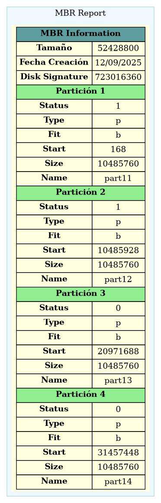
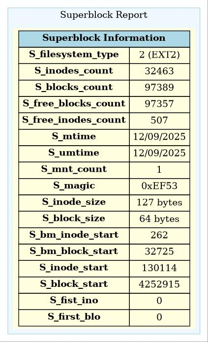
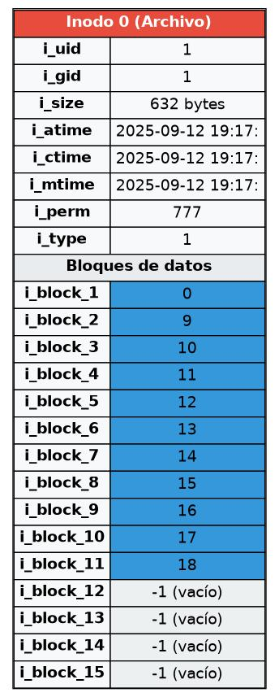
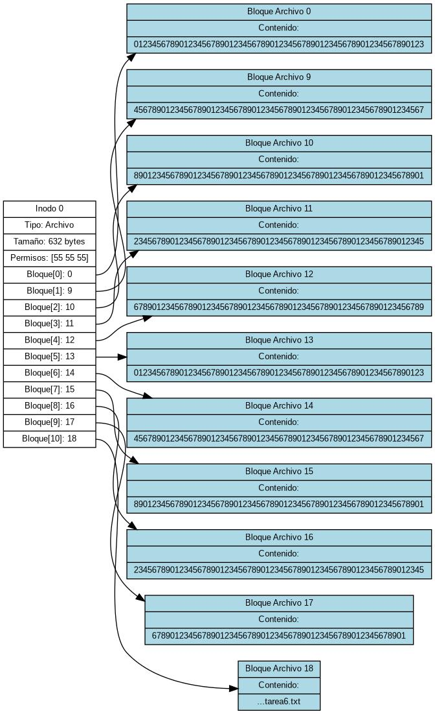
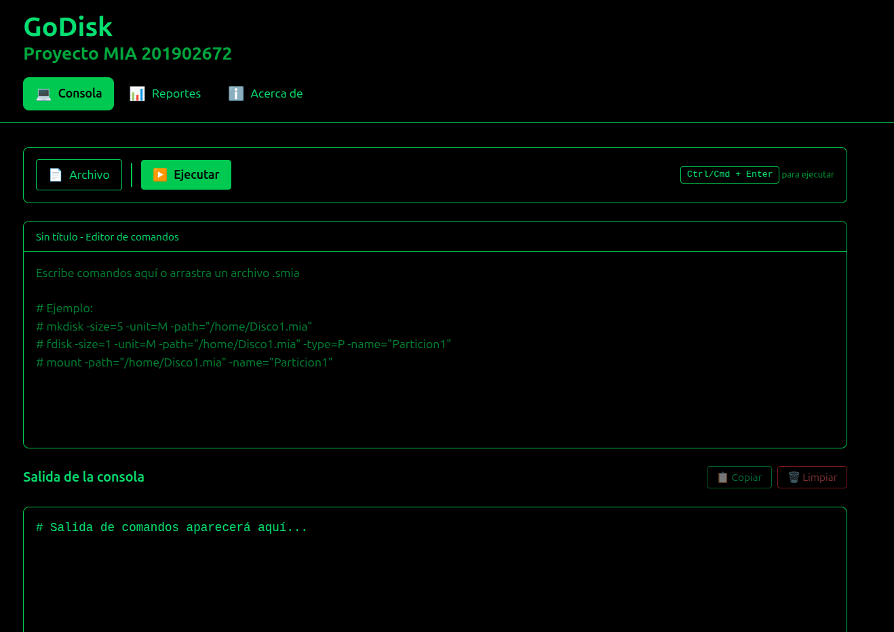

# 📂 Proyecto MIA - GoDisk EXT2  

Este proyecto implementa un **sistema de archivos basado en EXT2** utilizando el lenguaje de programación **Go**.  
El objetivo principal es **aprender y comprender** cómo funcionan internamente los discos, particiones, inodos, bloques, permisos y usuarios en un sistema de archivos real, pero desde un entorno controlado y multiplataforma.

---

## 🛠 Tecnologías utilizadas
- **Lenguaje principal:** Go (Golang)  
- **Lenguaje Frontend:** Javascript + React
- **Estructuras:** MBR, Particiones Primarias/Extendidas/Lógicas, SuperBloque, Inodos, Bloques de Carpetas/Archivos, EBR  
- **Gestión de archivos:** Operaciones con binarios simulando discos  
- **Reportes:** Generación de diagramas con Graphviz (.dot → .jpg/.png)  
- **CLI personalizada:** Analizador de comandos tipo consola Linux  

---

## ⚙️ Funcionamiento General
1. Se crean discos virtuales (archivos `.mia`) donde se gestionan particiones.  
2. Las particiones pueden montarse y formatearse en **EXT2**.  
3. Se soporta administración de usuarios, permisos, creación de carpetas y archivos.  
4. Se pueden generar **reportes gráficos** de estructuras internas: MBR, Superbloque, Inodos, Bloques, Bitmaps, Árboles, etc.  
5. Todos los comandos son interpretados por el módulo **Analizador** que recibe parámetros estilo Linux.

---

## 📌 Comandos principales

### 🔹 Administración de Discos
- **Crear disco**
  ```bash
  mkdisk -size=50 -unit=M -fit=ff -path=/home/user/Discos/Disco1.mia
  ```
- **Eliminar disco**
  ```bash
  rmdisk -path=/home/user/Discos/Disco1.mia
  ```
- **Particionar disco**
  ```bash
  fdisk -size=20 -unit=M -type=p -fit=wf -name=Part1 -path=/home/user/Discos/Disco1.mia
  ```

### 🔹 Montaje y Formateo
- **Montar partición**
  ```bash
  mount -path=/home/user/Discos/Disco1.mia -name=Part1
  ```
- **Listar montajes**
  ```bash
  mounted
  ```
- **Formatear (EXT2)**
  ```bash
  mkfs -id=721A -type=full -fs=2fs
  ```

### 🔹 Usuarios y Grupos
- **Login**
  ```bash
  login -user=root -pass=123 -id=721A
  ```
- **Logout**
  ```bash
  logout
  ```
- **Crear grupo**
  ```bash
  mkgrp -name=usuarios
  ```
- **Eliminar grupo**
  ```bash
  rmgrp -name=usuarios
  ```
- **Crear usuario**
  ```bash
  mkusr -user=jairo -pass=1111 -grp=usuarios
  ```
- **Eliminar usuario**
  ```bash
  rmusr -user=jairo
  ```
- **Cambiar grupo**
  ```bash
  chgrp -user=jairo -grp=admin
  ```

### 🔹 Manejo de Archivos y Directorios
- **Crear directorio**
  ```bash
  mkdir -path=/home/user/docs/usac -p
  ```
- **Crear archivo**
  ```bash
  mkfile -path=/home/user/docs/archivo.txt -size=100
  ```
- **Leer archivo**
  ```bash
  cat -file=/home/user/docs/archivo.txt
  ```

### 🔹 Reportes
- **Generar reporte de MBR**
  ```bash
  rep -name=mbr -path=/home/user/Reportes/mbr.jpg -id=721A
  ```
- **Generar reporte de Superbloque**
  ```bash
  rep -name=sb -path=/home/user/Reportes/sb.jpg -id=721A
  ```
- **Reporte de inodos**
  ```bash
  rep -name=inode -path=/home/user/Reportes/inodos.jpg -id=721A
  ```
- **Reporte de bloques**
  ```bash
  rep -name=block -path=/home/user/Reportes/bloques.jpg -id=721A
  ```
- **Reporte de árbol de directorios**
  ```bash
  rep -name=tree -path=/home/user/Reportes/tree.jpg -id=721A
  ```
- **Reporte de bitmap de inodos**
  ```bash
  rep -name=bm_inode -path=/home/user/Reportes/bm_inodos.txt -id=721A
  ```

---

## 📂 Estructura del Proyecto
```
├── Analizador/        # Parser de comandos CLI
├── Entornos/          # Manejo de discos y particiones
├── Estructuras/       # Inodos, bloques, superbloques, EXT2
├── AdmPermisos/       # Archivos, directorios y permisos
├── Usuarios/          # Login, grupos y usuarios
├── Reportes/          # Generación de reportes gráficos
├── Utils/             # Funciones auxiliares de lectura/escritura
```

---

---

## 🖼️ Ejemplos de Reportes e Interfaz

A continuación se muestran algunos ejemplos de los reportes y la interfaz generados por el proyecto:

### 📊 Reportes Generados
- **Reporte de MBR**
  

- **Reporte de SuperBloque**
  

- **Reporte de Inodos**
  

- **Reporte de Árbol de Directorios**
  

### 🖥️ Interfaz (CLI)
Ejemplo de uso de comandos en la consola personalizada:


---


## 🚀 Ejecución
1. Compilar el proyecto:
   ```bash
   go run main.go
   ```
2. Ingresar comandos en la consola propia del sistema:
   ```bash
   > mkdisk -size=50 -unit=M -path=/home/user/Discos/Disco1.mia
   ```

---

## ✨ Autor
**Jairo Adelso Gómez Hernández**  
_Carnet: 201902672_  
Curso: Manejo e Implementación de Archivos - 2S 2025  

---
📌 Este proyecto es académico y tiene como fin **aprender la implementación práctica de sistemas de archivos** sin depender de hardware físico.